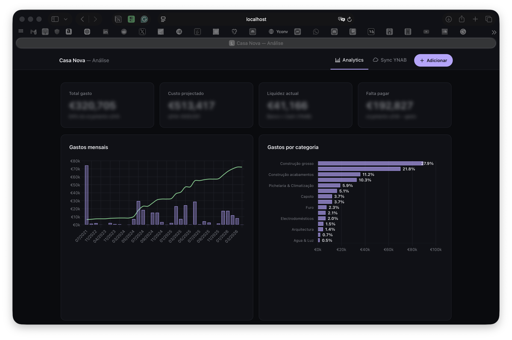
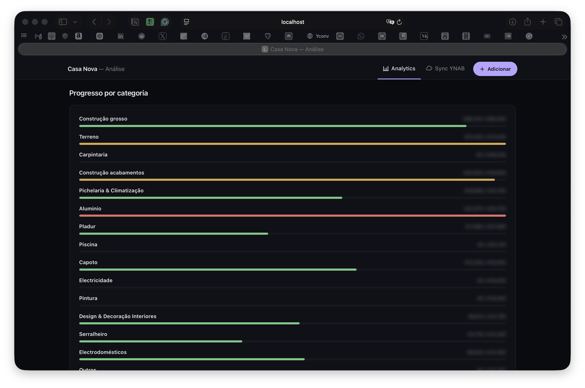
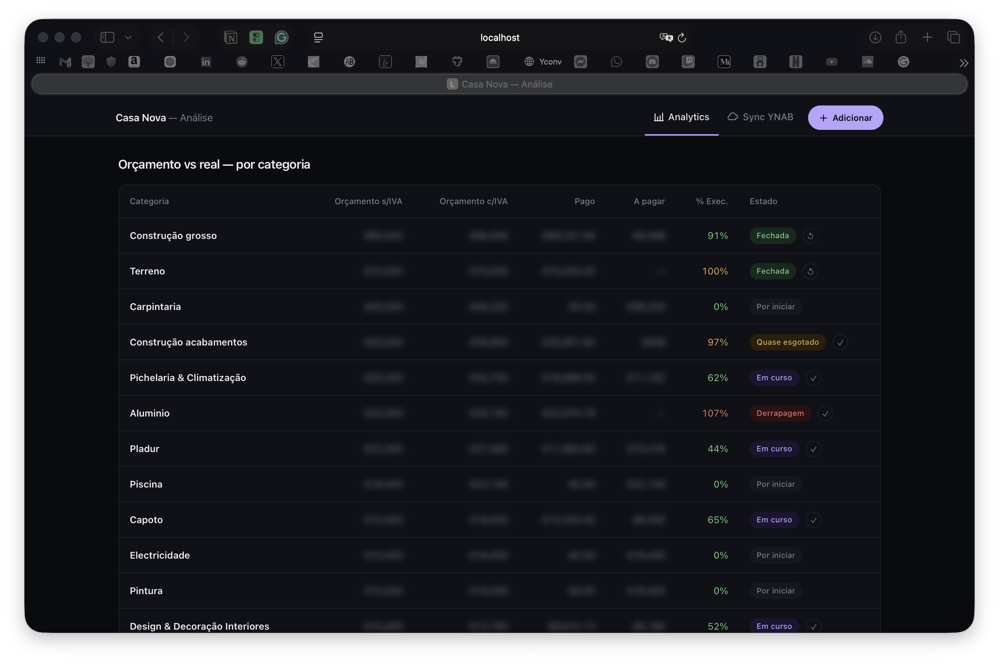
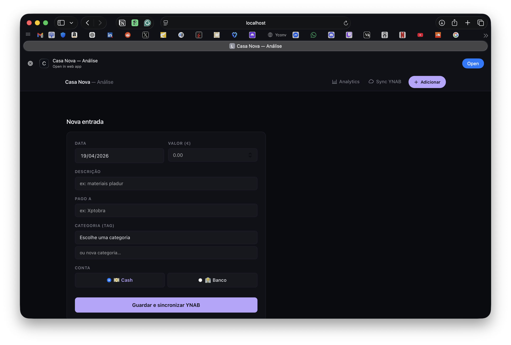

# Casa Nova

Small Flask app I built to track the costs of my house construction and keep my budget spreadsheet in sync with YNAB (the app I use for personal finances).

Before this, I was copying every transaction from YNAB into an Excel by hand. Half the time I forgot, half the time I put the wrong category, and I never really knew what was already paid and what wasn't. Now the spreadsheet holds the budget, YNAB holds the bank feed, and this app makes sure both sides agree.

All the numbers in the screenshots are blurred with a bit of CSS (demo mode, just add `?demo=1` to the URL). The real values only live on my Mac.

---

## Screenshots

**Dashboard** — four KPIs, monthly spend bars with a cumulative line, and spend by category.



**Progress by category** — one bar per category. Green is ok, orange is close to the limit, red means I went over, grey is not started yet.



**Budget vs actual** — same thing as the bars but in a table, with a button to close a category when it's finished (or reopen it if I need to).



**Add entry** — manual form. I type the data once, the app writes the row to Excel and pushes the transaction to YNAB in the same click.



---

## How it works

Three things talk to each other:

1. The **Excel spreadsheet** (`Custos Casa Nova - Nova2.xlsx`, not in this repo, lives in iCloud) — one row per transaction, with a `YNAB_ID` column that links each row to a bank transaction.
2. **YNAB** — the bank feed. One real account (my bank) plus one manual "Cash" account for when I pay with cash.
3. **This app** — the glue in the middle.

The app reads the spreadsheet with `openpyxl`, pulls transactions from YNAB through their REST API, and shows in `/sync` everything that exists on one side but not on the other. For each one I can:

- **Importar** — create a new row in the spreadsheet with that transaction
- **Ligar** — attach the YNAB id to a row I already typed by hand (happens when I add the purchase before the bank settles it)
- **Ignorar** — skip (for transfers, refunds, noise)

Categories (tags) and budgets both come from the same workbook, just on different sheets.

---

## Stack

- Python 3.9 + Flask, served on `localhost:5001`
- `openpyxl` to read and write the Excel file
- YNAB REST API v1 for the bank side
- Chart.js 4 for the two charts on the dashboard
- Plain CSS, no framework. Dark theme.
- A launchd agent that starts the Flask server at login, so I don't have to think about it

No database. The spreadsheet is the database. YNAB is the second source of truth. The app is stateless between requests.

---

## Security

- The YNAB personal token is kept in an RTF file under `~/Documents/Finance/` and read at startup. It is **not** in this repo.
- The spreadsheet is gitignored.
- The server binds to `0.0.0.0:5001` so I can hit it from my phone on the home wifi, but there is no auth. It is only meant for the local network.

---

## Built with Claude

I am not an engineer. The whole thing — Flask backend, YNAB reconciliation, templates, CSS, launchd setup, demo mode — was paired with Claude Code over three sessions:

1. A one-shot script (`reconcile.py`) to import the YNAB history into the spreadsheet
2. The Flask app itself with the dashboard, the add-entry flow, and the sync page
3. Polish: closing categories, auto-start at login, demo mode for these screenshots

Keeping it here as a small reference of what someone who can't code can still ship in a weekend with a good AI pair.

---

## Repo layout

```
app.py               — Flask routes and main logic
reconcile.py         — one-off import script (phase 1)
dashboard.py         — old file, not used anymore
templates/
  layout.html        — base template and global CSS
  analytics.html     — main dashboard
  add.html           — manual entry form
  sync.html          — YNAB reconciliation page
category_status.json — which categories are closed
docs/screenshots/    — demo-mode screenshots for this README
```
